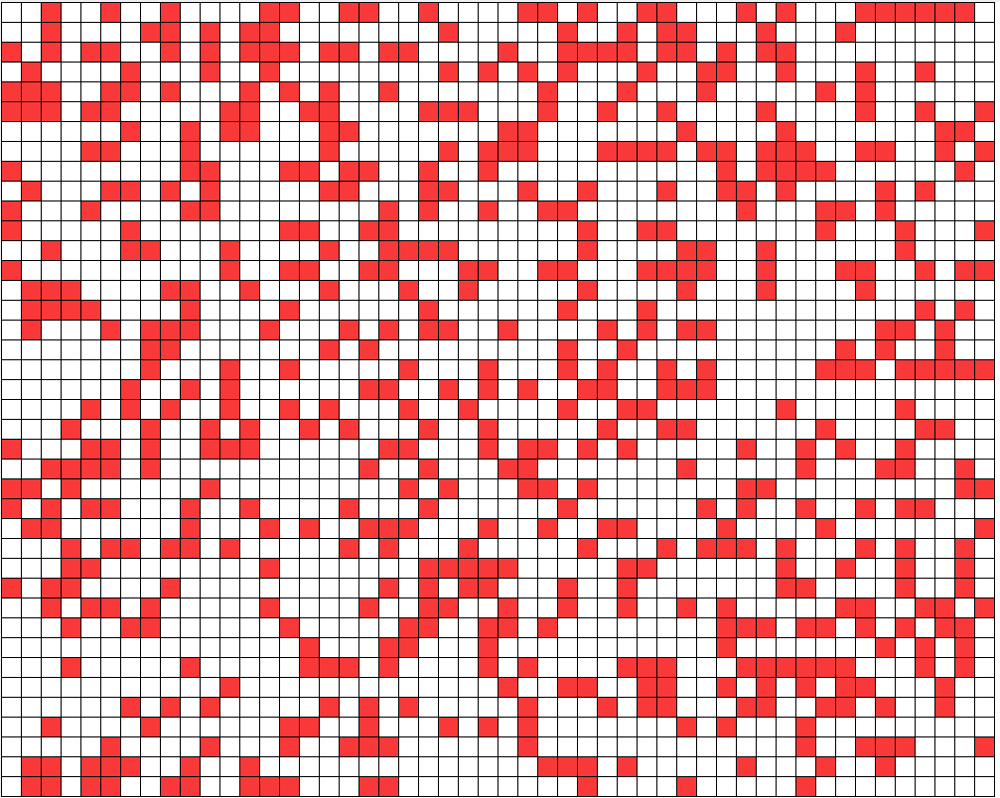
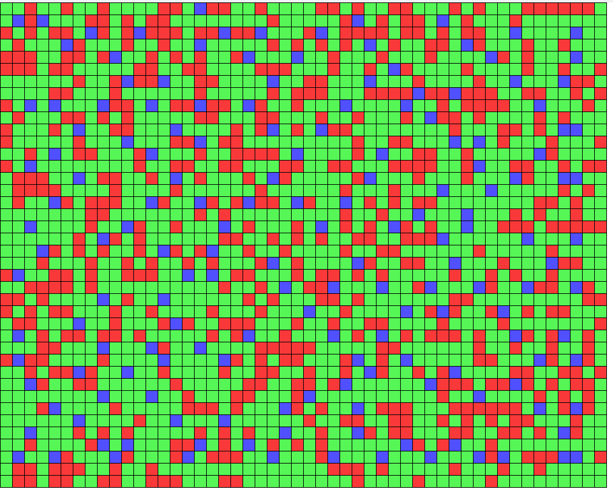
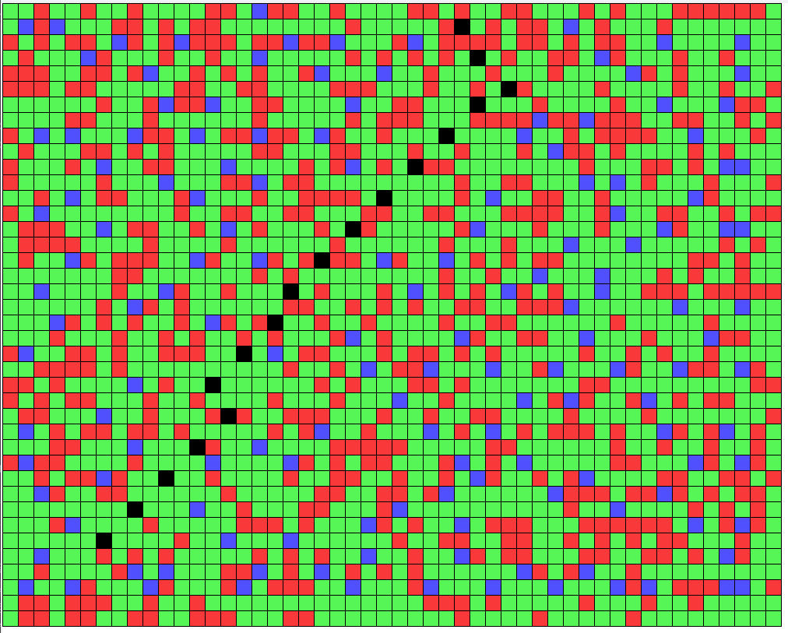

# Project
* white - empty cells
* red - obstructed blocks
* blue - towers
* green - coverage zone
* black (on the window with reliable path) - reliable path from tower to tower

## Creation of a city
```python
a = CityGrid(40, 50)
a.show_grid()
```


## Optimization algorithm
```python
a.add_effective_towers()
a.show_grid()
```


## Finding of the reliable path
```python
a.find_reliable_path(34, 6, 1, 29)
```
